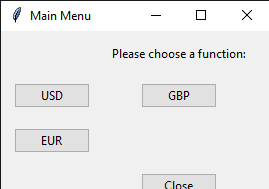
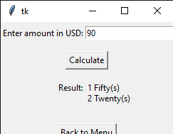

# Personal-Finance-Program

## Project Desc.
---

This project takes the amount you entered in, and finds the correct bill and coin amout needed in actual physical money!

## Installation
---

NOT USED FOR CLASS.  

## Execution and Usage
---

This program is guided by text to ask the users what they want to convert, it allows them to switch back and forth from 3 different currency types, and is accurate.

## Used Technology
---

+ First library in repo
`pip install csv` 

## Current Features
---

+ Windowed menu

+ Accurate measurements

+ Streamline menus

## Contributions
---
NOT USED FOR CLASS

## Contributers
---

+ Github copilot, helped fix some issues found in the code

+ Tkinter team, their documentation allowed me to do things with it to make this project what it was

## Author's Information
---
Vincent Johnson is an asipring python developer and is currently in high-school. He has made a lot of projects for school and involves himself in the cybersecurity community. He has been mentored by his father and uncle, who both work in the cybersecurity industry. He has some experience in Java and mainly codes using python.

## Change log
---
Version 1.0 -- Added everything, all 3 conversions and their files along with CSV files.

## License
---
NOT USED FOR CLASS
